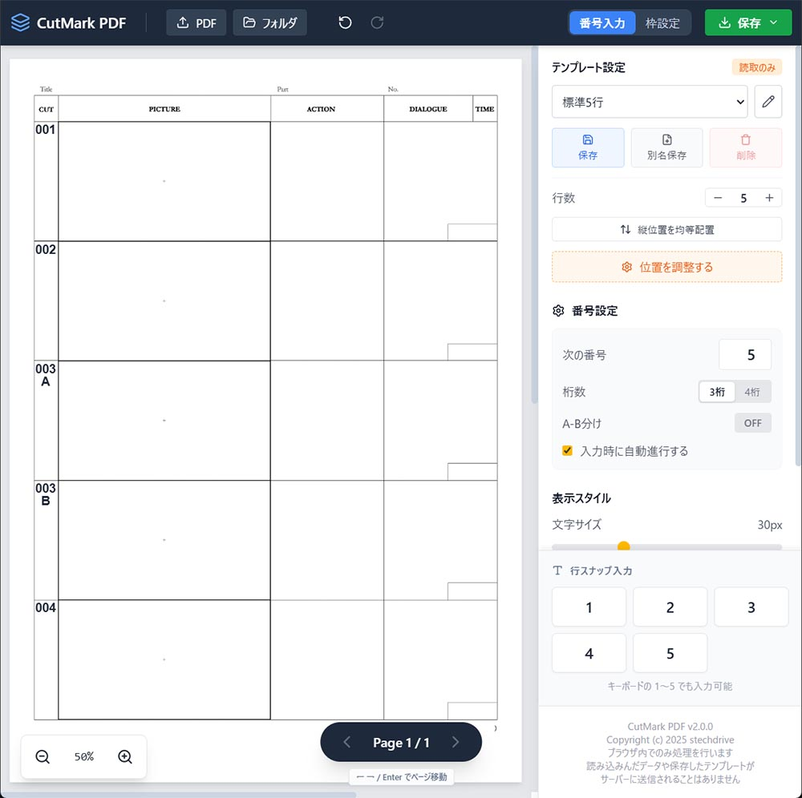

# CutMark PDF

PDF または連番画像の絵コンテにカット番号を配置し、ブラウザ内だけで書き出せるツールです。  
アプリ本体は GitHub Pages で公開しており、ファイル処理はクライアント側で完結します。

## [✨ CutMark PDF を開く ✨](https://stechdrive.github.io/CutMark-PDF/)
## [✨ 連番画像向け Photoshop プラグイン CutMark ✨](https://github.com/stechdrive/CutMark)

## できること

- 1 つの PDF、または連番の `JPG / JPEG / PNG` を読み込む
- 絵コンテ上にカット番号をクリック配置する
- テンプレートの基準線に合わせて行スナップ配置する
- 配置済み番号をドラッグ移動、削除、Undo / Redo する
- 選択したカット以降を現在の採番設定で再採番する
- PDF または ZIP 書き出し時に `.cutmark` プロジェクトを同時保存する
- 修正版素材に対して、保存済みプロジェクトを再割当して再利用する
- モバイル UI で設定パネルとページ整理パネルをボトムシート表示する

PDF を元にした書き出しでは、カット番号は画像焼き込みではなく PDF 上のベクター文字として追加されます。

## 対応する入出力

### 読み込み

- PDF: 1 ファイル
- 連番画像: `JPG / JPEG / PNG`
- プロジェクト: `.cutmark`
- 互換入力: `.json` のプロジェクトファイルも読み込み可能

素材は `PDF 1 つ` または `連番画像一式` のどちらか一方だけを扱います。  
PDF と画像の同時読み込みはできません。

### 書き出し

- PDF 入力時: 元 PDF にカット番号を重ねた新しい PDF
- 画像入力時: カット番号を反映した PDF
- 画像入力時のみ: カット番号入り連番画像を ZIP 書き出し
- 任意で `.cutmark` プロジェクトファイルを同時保存

## 主な機能

### 採番と配置

- クリックした位置にカット番号を配置
- テンプレートの番号列付近をクリックすると、最も近い行へ自動スナップ
- `1`〜`9` キーで各行へ直接配置
- 次番号、桁数、A-B 分け、自動インクリメントを設定可能
- A-B 分け時は枝番を 2 行表示で配置
- 選択したカットから後ろを、現在の「次の番号」で再採番できる

### 編集

- 配置済み番号のドラッグ移動
- 選択中番号の削除
- `Ctrl+Z / Cmd+Z` で Undo
- `Ctrl+Shift+Z / Cmd+Shift+Z` で Redo
- `← / → / Enter` でページ移動

### 表示スタイル

- 文字サイズ
- 白フチの太さ
- 白背景の ON / OFF
- 白背景の余白量
- 行スナップの ON / OFF

### テンプレート

- 行数は 1〜9 行
- 赤い縦線で番号列位置を調整
- 青い横線で各行位置を調整
- 1 行目と最終行を基準に中間行を均等再配置
- テンプレートの保存、上書き、削除、切り替え
- テンプレートはブラウザの `localStorage` に保存

### プロジェクト再利用

- 現在の logical page 構成、カット番号、採番設定、表示設定、テンプレート状態を `.cutmark` として保存
- プロジェクトと素材を同時読み込み可能
- 保存済みプロジェクトを現在素材に対して自動候補割付
- 左側のページ整理パネルで割付確認、移動、未割付化、空欄挿入、削除が可能
- 割付が完了していない場合は書き出し前に警告

## 操作の流れ

### 1. 素材を読み込む

- 上部の `読み込み` から選択
- または中央プレビューへドラッグ＆ドロップ
- プロジェクトを一緒に読み込む場合は `.cutmark` も同時に選択可能

### 2. カット番号を配置する

- クリックで配置
- テンプレート列の近くなら行スナップ
- 右パネルの `番号設定` で採番ルールを調整

### 3. 必要ならテンプレートを調整する

- 上部モードを `用紙` に切り替え
- 赤線と青線をドラッグして位置調整
- テンプレートを保存

### 4. プロジェクトを一緒に保存する

- `保存` メニューからプロジェクトファイル保存を有効化
- PDF または ZIP と一緒に `.cutmark` を保存

### 5. 修正版素材へ再適用する

- 修正版の PDF / 連番画像と `.cutmark` を読み込む
- 左パネルのページ整理で自動割付を確認
- 必要に応じてドラッグで並べ替えや差し込み調整
- `適用` 後に書き出し

## モバイル対応

現在のモバイル UI は単なる CSS ブレークポイント切替ではなく、入力特性と実 viewport を使って切り替えています。

- `pointer: coarse` と `visualViewport.width` を使ってモバイル UI を判定
- Android 系の表示スケーリング差は `screen.width` で補正
- `visualViewport.height` を使ってブラウザ UI 出入り時の高さブレを吸収
- `safe-area` を考慮してノッチやホームインジケータを回避
- モバイルでは設定パネルとページ整理パネルをボトムシート表示
- モバイル専用の `端末表示倍率` を搭載

### モバイルの端末表示倍率

- モバイル UI 時だけ表示
- 範囲は `70% 〜 200%`
- 自動補正の上に手動倍率を掛ける方式
- 保存先はその端末の `localStorage`
- プロジェクトファイルには含まれません

## キーボードショートカット

- `1`〜`9`: 対応する行へカット番号を配置
- `←`: 前のページ
- `→`: 次のページ
- `Enter`: 次のページ
- `Ctrl+Z / Cmd+Z`: Undo
- `Ctrl+Shift+Z / Cmd+Shift+Z`: Redo

入力欄やセレクトにフォーカスがあるときは、これらのショートカットは無効です。

## セキュリティと保存場所

- 読み込んだ PDF、画像、プロジェクトはブラウザ内で処理
- サーバーへアップロードする処理はなし
- テンプレートとモバイル表示倍率は `localStorage` に保存
- 書き出し結果はブラウザからダウンロード
