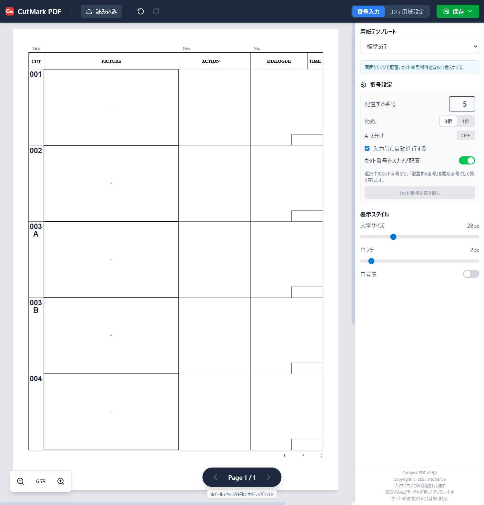

# CutMark PDF

PDF や連番画像の絵コンテに、カット番号をクリックで配置して書き出せるツールです。  
ブラウザ版はインストール不要で、読み込んだファイルはサーバーへアップロードされません。

## すぐ使う

- [ブラウザ版を開く](https://stechdrive.github.io/CutMark-PDF/)
- [Windows Portable版をダウンロード](https://github.com/stechdrive/CutMark-PDF/releases/latest/download/CutMark-PDF-Windows-Portable-x64.zip)
- [Windows Setup版をダウンロード](https://github.com/stechdrive/CutMark-PDF/releases/latest/download/CutMark-PDF-Windows-Setup-x64.exe)

## Windows版の選び方

通常は **Portable版** をおすすめします。ZIPを展開して `CutMark PDF.exe` を起動するだけで使えます。

**Setup版** は、Windows標準の「インストール済みアプリ」として管理したい場合や、Portable版が起動しない環境で使ってください。スタートメニュー登録とアンインストールに対応します。

Windows版は未署名です。起動時に SmartScreen などの警告が出る場合があります。配布元は GitHub Releases のみです。

## できること

- PDF、または `JPG / JPEG / PNG` の連番画像を読み込む
- 絵コンテ上をクリックしてカット番号を配置する
- テンプレートの行位置に合わせて番号をスナップ配置する
- 番号の桁数、A/Bなどの枝番、自動インクリメントを設定する
- 配置した番号をドラッグ移動、削除、Undo / Redo する
- 選択したカット番号から後続番号を振り直す
- PDFとして書き出す
- 画像読み込み時は、カット番号入りの連番画像ZIPとしても書き出す
- `.cutmark` プロジェクトファイルを保存して、修正版素材へ再利用する

PDFを元にした書き出しでは、カット番号は画像として焼き込むのではなく、PDF上の文字として追加されます。

## 基本の使い方

### 1. 素材を読み込む

画面上部の `読み込み` から、PDFまたは連番画像を選びます。  
中央のプレビューへドラッグ＆ドロップしても読み込めます。

読み込める素材は次のどちらかです。

- PDF: 1ファイル
- 連番画像: `JPG / JPEG / PNG`

PDFと画像を同時に素材として読み込むことはできません。

### 2. カット番号を配置する

番号を置きたい位置をクリックすると、現在の番号設定でカット番号が配置されます。  
コンテ用紙の番号列付近をクリックすると、近い行へ自動でスナップします。

`1` から `9` のキーを押すと、対応する行へ直接配置できます。

### 3. 番号を調整する

右側の番号設定で、次に配置する番号や表示形式を変えられます。

- 配置する番号
- 桁数
- A/Bなどの枝番
- 自動インクリメント
- 行スナップのON/OFF

配置済みの番号を選んで `カット番号を振り直し` を使うと、その番号から後ろを現在の番号設定で振り直せます。

### 4. 見た目を調整する

右側の表示設定で、カット番号の見た目を調整できます。

- 文字サイズ
- 白フチの太さ
- 白背景のON/OFF
- 白背景の余白

### 5. コンテ用紙に合わせる

上部の `コンテ用紙設定` に切り替えると、番号を置く基準位置を調整できます。

- 赤い縦線: カット番号列の位置
- 青い横線: 各行の位置
- 行数: 1から9行

調整した用紙設定は保存できます。よく使う用紙ごとにテンプレートを分けておくと、次回以降すぐに使えます。

## 書き出し

上部の `保存` から書き出します。

- PDF入力時: カット番号を追加したPDFを書き出し
- 画像入力時: カット番号を追加したPDFを書き出し
- 画像入力時: カット番号入り連番画像をZIPで書き出し
- 必要に応じて `.cutmark` プロジェクトファイルも同時保存

`.cutmark` を保存しておくと、あとから修正版の素材にカット番号を再利用できます。

## 修正版素材に再利用する

前回保存した `.cutmark` と、新しいPDFまたは連番画像を一緒に読み込みます。  
左側のページ整理パネルで、前回のカット番号ページと今回の素材ページの対応を確認できます。

ページが増えたり減ったりしている場合は、次の操作で調整します。

- ドラッグしてページの対応を入れ替える
- 空欄を挿入して後ろのページをずらす
- 不要なカット番号ページを削除する
- いったん未割付にする

対応が決まったら `適用` を押します。  
番号を揃え直したい場合は、基準にしたいカット番号を選んで `カット番号を振り直し` を使ってください。

## テンプレートの受け渡し

コンテ用紙設定はテンプレートとして保存できます。  
保存したテンプレートはJSONとして書き出し、別のブラウザや別のPCへ読み込めます。

## モバイルで使う

スマートフォンやタブレットでは、設定パネルとページ整理パネルが下から開く表示になります。  
画面が小さい端末では、端末ごとの表示倍率を調整できます。

## キーボードショートカット

- `1`〜`9`: 対応する行へカット番号を配置
- `←`: 前のページ
- `→`: 次のページ
- `Enter`: 次のページ
- `Ctrl+Z / Cmd+Z`: 元に戻す
- `Ctrl+Shift+Z / Cmd+Shift+Z`: やり直す

入力欄やセレクトにフォーカスがあるときは、ショートカットは無効になります。

## 対応ファイル

読み込み:

- PDF
- `JPG / JPEG / PNG`
- `.cutmark`
- テンプレートJSON

書き出し:

- PDF
- 連番画像ZIP
- `.cutmark`
- テンプレートJSON

## ファイルの扱い

読み込んだPDF、画像、プロジェクトファイルは端末内で処理されます。  
サーバーへアップロードする処理はありません。

ブラウザ版では、テンプレートなどの設定はお使いのブラウザ内に保存されます。

## 関連ツール

連番画像向けのPhotoshopプラグインはこちらです。  
[CutMark Photoshop Plugin](https://github.com/stechdrive/CutMark)
